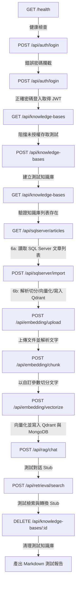

# API 測試與故障排除指引 (API Testing & Troubleshooting Guide)

本文件說明如何對架設於遠端主機 `10.10.130.45:53020` 的 AiRAG 後端 API 進行整合測試，以及解決部署時常見的密碼認證故障問題。

---

## 1. 發現的關鍵故障：Docker Compose 雜湊值擴充 Bug

### 異常現象
使用預設的 `admin` / `admin` 帳密登入時，遠端伺服器持續回傳 `401 Unauthorized` 錯誤。

### 根本原因
在 `.env` 檔案中，密碼哈希為標準的 Bcrypt 格式：
`AUTH_PASSWORD_HASH=$2b$12$XOLoLbldxgU3vdmkYsTEteZqF02GKcAw6zIWXNy6Q7yJwi9kziqsm`

當 Docker Compose 載入 `.env` 並啟動容器時，**`$` 符號會被自動視為「環境變數擴充 (Variable Expansion)」語法**。
Docker Compose 嘗試尋找名為 `$2b`、`$12` 與 `$XOLo` 的變數，由於主機中不存在這些變數，它們會被替換為空字串。這導致傳入容器內部的哈希字串被截斷損毀。

### 解決方案
在 Docker 部署環境中，若要將帶有 `$` 符號的字串作為字面量傳入，必須使用 **雙金錢符號 `$$`** 進行轉義。

我們已更新 `docker-compose.yml` 中的 `environment` 段落：
```yaml
    environment:
      - MONGODB_URL=mongodb://mongodb:27017
      - QDRANT_HOST=qdrant
      - VLLM_BASE_URL=http://host.docker.internal:8080/v1
      - LLAMACPP_BASE_URL=http://host.docker.internal:8081
      - AUTH_PASSWORD_HASH=$$2b$$12$$XOLoLbldxgU3vdmkYsTEteZqF02GKcAw6zIWXNy6Q7yJwi9kziqsm
```

*(註：已移除 `SQLSERVER_CONNECTION_STRING` 的 Docker Compose 覆寫，改為直接由 `backend/.env` 讀取實體 IP `10.10.130.220` 的標準 ODBC 連線。)*

---

## 2. 測試腳本架構與執行

我們在 `tests/test_api.py` 中撰寫了無套件相依（僅使用 Python 內建 `urllib`）的輕量級 API 測試套件。該腳本可自動執行以下完整的測試鏈：

### 測試流程與端點



### SQL Server 既有知識庫端點說明

我們新增了以下兩個專屬的 SQL Server 連線端點，可用於串接企業既有知識庫（如 `articles` 表）：

1. **`GET /api/sqlserver/articles` — 分頁查詢 SQL Server 文章**
   * **功能**：查詢 SQL Server 中的文章清單，支援分頁 (`page`, `page_size`) 及關鍵字搜尋 (`search`)。
   * **權限**：需 Bearer JWT 認證。
   
2. **`POST /api/sqlserver/import` — 一鍵向量化匯入 Qdrant**
   * **功能**：由指定的 `article_id` 提取 Markdown 內容與 Metadata，在記憶體中完成 Recursive 切分與地端 Qwen 向量化，直接注入指定的 Qdrant 知識庫中，並累加該知識庫的 MongoDB Chunk 計數。
   * **權限**：需 Bearer JWT 認證。

### 執行測試指令
在您同步更新遠端的程式碼並重啟後，請在本地終端機執行：
```powershell
python tests/test_api.py
```

### 測試報告輸出路徑
測試完成後，會自動在 [tests/test_report.md](file:///d:/檔案分享/程式碼/AiRAG/tests/test_report.md) 寫入完整的執行結果與每個 API 端點的詳細 JSON 響應。

