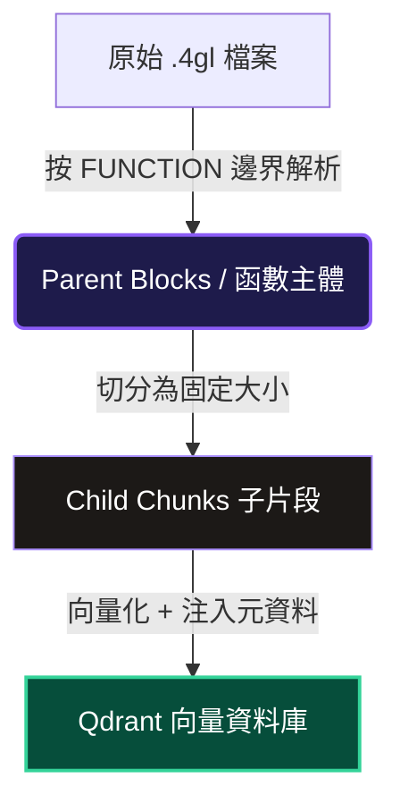
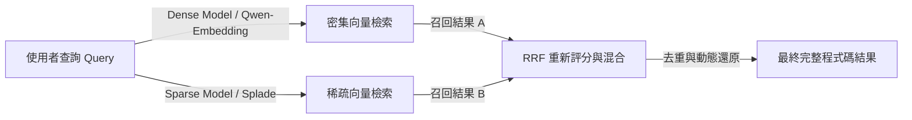

# 程式碼混合檢索與切分策略筆記 (Code Hybrid Search & Chunking Strategy Guide)

本筆記整理了針對程式碼（以 `.4gl` 為代表）在 RAG 系統中的切分策略、向量庫儲存設計、以及混合檢索 (Hybrid Search) 的實現細節。

---

## 一、 為什麼常規文字切分與檢索不適用於程式碼？

在處理一般文本（如 PDF 或 Word 檔案）時，我們通常會使用固定字元長度（如 512 字元）搭配重疊區間（Overlap）進行切分。然而，這種方式在處理程式碼時會面臨以下重大痛點：

| 痛點類型 | 表現形式 | 產生的後果 |
| :--- | :--- | :--- |
| **結構斷裂** | 函數（Function）被攔腰切斷，宣告與邏輯被分在不同的 Chunk。 | AI 無法取得完整的程式碼脈絡，導致回答錯誤或語法錯誤。 |
| **檢索特徵稀釋** | 若將整個大檔案當作一個 Chunk，語意特徵會被過度稀釋。 | 檢索相似度分數過低，難以被精準召回。 |
| **關鍵字失效** | 程式碼中的特定變數或函數名（如 `p_qry_cs`）在純語意向量搜尋中可能因為詞義相近而被略過。 | 搜尋特定函數時，無法精確定位到對應代碼。 |

---

## 二、 專屬程式碼切分策略：Parent-Child (大小雙層) 結構切分

為了解決上述痛點，系統針對程式碼採取了 **Parent-Child (大小雙層)** 的切分與還原設計：



### 1. 解析階段 (Parent-Child Splitting)
* **Parent Block (父區塊)**：系統會掃描 `.4gl` 程式碼，尋找 `FUNCTION` 與 `END FUNCTION` 區間，將每個完整的函數解析為一個獨立的 Parent Block。
* **Child Chunk (子片段)**：由於單個函數可能包含數千行程式碼，直接進行向量化會因 Token 長度超限而導致特徵被稀釋。因此，系統會將每個 Parent Block 再切分為數個較小的 Child Chunks（例如 512 字元長，搭配 50 字元重疊區間）。

### 2. 向量庫儲存設計 (Qdrant Schema)
每個寫入 Qdrant 的點 (Point) 代表一個 **Child Chunk**。為了能夠在檢索時重新拼裝，每個點的 Payload 都攜帶了關鍵的 Metadata：
* `parent_id`：指明該片段屬於哪一個函數/父區塊。
* `parent_chunk_index_range`：該 Parent Block 被切分出的子片段索引範圍（例如 `"4~16"`，代表是由第 4 段到第 16 段組成的完整函數）。
* `chunk_index`：該 Child 在檔案中的絕對索引序號。
* `filename` / `tags` / `function_name`：基礎標註元資料。

> [!IMPORTANT]
> **資料庫空間優化（無預存模式）**：
> 我們在 Metadata 中**不預先存儲**龐大的 `parent_content` 程式碼，以避免千倍的儲存空間暴增（避免 `413 Request Entity Too Large`）。我們改在檢索端執行「動態拼接還原」。

### 3. 檢索與動態拼接還原 (Retrieval & Merging)
當使用者發起搜尋時，後端會執行以下精密的還原與去重邏輯：

1. **兄弟節點去重**：如果搜尋結果中召回了同一個 `parent_id` 的多個 Child Chunks（例如同時召回了 `#4` 和 `#5`），系統會**去重並僅保留相似度分數最高的那一個**，防止重複顯示相同的程式碼塊。
2. **非同步動態拼接 (get_siblings_and_merge)**：對於被召回的子片段，系統會依據其 `parent_id` 從 Qdrant 撈取該函數所屬的**所有兄弟片段**（即 `#4` 到 `#16`）。
3. **重疊消除與還原**：將兄弟片段依 `chunk_index` 排序，並透過字元級的比對，消除相鄰片段之間的 overlap 重疊字元，完美拼接還原出最原始、無重複的完整 `FUNCTION` 代碼與 `chunk_index` 範圍（如 `#4~16`）回傳給使用者或 AI。

---

## 三、 混合檢索 (Hybrid Search) 雙路召回機制

程式碼的檢索需要兼顧「精確變數名/函數名匹配」與「程式功能描述的語意匹配」。因此，系統實現了 **Dense (密集向量) + Sparse (稀疏向量) 雙路召回與 RRF 混合檢索**：



### 1. 密集向量檢索 (Dense Vector Search)
* **特點**：捕捉整段文字的「語意相似度」。
* **優點**：即使使用者沒有輸入精確的函數名，而是輸入概念描述（例如：「查詢客戶信用額度」），系統也能藉由語意召回與此功能相關的程式碼區塊。

### 2. 稀疏向量檢索 (Sparse Vector Search - SPLADE)
* **特點**：模擬傳統的關鍵字檢索 (TF-IDF / BM25)，但具有上下文權重感知。它產生的向量大部分是 `0`，僅在對應詞庫的特定關鍵字上有權重分數。
* **優點**：對於程式碼中的特殊符號、精確的 API 名稱、變數名或函數名（例如 `p_qry_cs`）有極強的召回能力，能確保精確匹配，不漏掉任何關鍵字。

### 3. RRF (Reciprocal Rank Fusion) 相互排名融合
Qdrant 接收到兩路檢索請求後，會透過以下 RRF 公式對兩個結果列表進行重新評分與排名：

$$\text{RRF Score}(d) = \sum_{m \in M} \frac{1}{k + r_m(d)}$$

其中：
* $M$ 代表檢索方式的集合（密集向量與稀疏向量）。
* $r_m(d)$ 代表文件 $d$ 在檢索方式 $m$ 中的排名（Rank）。
* $k$ 是平滑常數（預設為 60）。

**優點**：RRF 不需要將不同模型的 Similarity Score 進行歸一化，僅依據排名來融合，能同時保證「語意相關」與「關鍵字精確匹配」的程式碼片段排在最前面。

---

## 四、 程式碼切分與混合檢索配置範例

### 1. 後端分切與向量化流程 (FastAPI)
```python
# 1. 執行 Parent-Child 分切
parents = parse_4gl_to_parents(raw_content, filename)
for parent in parents:
    children = slice_to_children(parent["content"], parent, ...)
    # 2. 注入索引區間 metadata，排除 parent_content 以優化 Payload 大小
    for child in children:
        child.metadata["parent_chunk_index_range"] = f"{start_idx}~{end_idx}"
```

### 2. 後端雙路召回檢索流程 (Qdrant client.query_points)
```python
# 使用 Qdrant Prefetch 機制執行 Hybrid 檢索
result = await client.query_points(
    collection_name=collection_name,
    prefetch=[
        # 1. 密集向量 Prefetch (Dense Search)
        models.Prefetch(
            query=dense_vector,
            limit=limit
        ),
        # 2. 稀疏向量 Prefetch (Sparse Search)
        models.Prefetch(
            query=models.SparseVector(using="sparse-text", indices=sparse_indices, values=sparse_values),
            using="sparse-text",
            limit=limit
        )
    ],
    # 3. 採用 RRF 混合演算法
    query=models.FusionQuery(fusion=models.Fusion.RRF),
    limit=limit
)
```

---

> [!TIP]
> **最佳實踐**：
> * **切分大小設定**：代碼切分時，建議將 Parent Chunker 按 `FUNCTION` 邊界切分；Child Chunks 的大小（Chunk Size）設為 `512`，重疊區間（Overlap）設為 `50`，可以達到最佳的特徵捕捉與召回效果。
> * **索引維護**：由於代碼更新頻繁，建議採用「重複檔案直接覆蓋 (Overwrite)」的模式，在寫入新向量前，自動調用 `delete_by_filename` 接口清理同名檔案的舊向量，保持向量庫的整潔與一致性。
