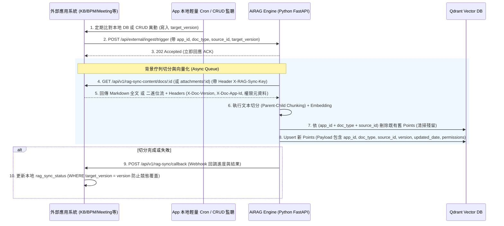

# 多應用 RAG 向量同步與附件 API 整合規劃（Multi-App RAG Sync Specification）

## 0. 文件資訊

- **狀態**：規劃中（v1.2）
- **建立日期**：2026-07-23
- **修訂記錄**：
  - v1.2（2026-07-23）依跟 `RAG_SYNC_PLAN.md` v1.3 的對齊稽核結果修訂：1) 新增 2.4 節「App 內容/回呼路徑登錄規範 (App Registry)」，解決 5.2 節第 10 項「內容拉取端點路徑跨應用不一致」；2) 2.1 節回報機制判斷邏輯改為查表驅動（`report_mode`），取代原本寫死的 `appId == "kb"` 字串判斷；3) 5.2 節新增第 11 項，記錄並要求以本文件為準修正 KB 文件範例的 3 處欄位/Header 落差（對應 `RAG_SYNC_PLAN.md` v1.4）。
  - v1.1（2026-07-23）：1) 2.1 節補充 `knowledgeBaseId` 來源與 `AIRAG_BASE_URL` 路徑拼接防護說明（避免重複 `/api/api/...`）；2) 2.1 節補充 `taskId` 追蹤說明；3) 第 4 節補充 HTTP 傳輸層 (camelCase) 與 Qdrant 內部 Payload (snake_case) 命名風格區隔說明；4) 5.2 節更新 KB 專案已在 `RAG_SYNC_PLAN.md` v1.3 完成對齊之紀錄。
  - v1.0（2026-07-23）：建立多應用通用規範初稿，完成混合回報、一個知識庫一個 Collection 等核心決策。
- **相關文件**：[RAG_SYNC_PLAN.md](RAG_SYNC_PLAN.md)（單一 KB 專屬舊版規劃）
- **目標**：提供一套**通用於多個獨立應用程式**（例如 GigaSolarKnowledgeBase、BPM、Meeting、NotesAPP、GeneralBackend 等異質系統）與 AiRAG / Qdrant 向量資料庫進行向量同步、文件切分、附件 API 與排程校驗的標準化架構。
- **架構轉變聲明**：
  原 [RAG_SYNC_PLAN.md](RAG_SYNC_PLAN.md) 僅針對單一知識庫系統（GigaSolarKnowledgeBase）設計，包含「AiRAG 直接連線 MSSQL 寫入進度」等單一系統假設。本規劃將其**升級為通用多應用 (Multi-App Framework) 規範**，並已於 2026-07-23 完成決策（詳見第 5 節）：
  1. **進度回報**：**混合模式**——KB（GigaSolarKnowledgeBase）沿用已決議的 AiRAG 直連 MSSQL 寫入（見 [RAG_SYNC_PLAN.md](RAG_SYNC_PLAN.md) 6.4 節），不重工；其餘新接入應用（BPM、Meeting 等）一律採標準化 **HTTP Webhook 回調 (API Callback)**。AiRAG 依 trigger 請求的 `appId` 與是否帶 `callbackUrl` 判斷走哪一條路徑（見 2.1 節）。
  2. **多租戶隔離**：**沿用現有「一個知識庫 = 一個 Qdrant collection」架構**（`KnowledgeBase.qdrant_collection_name`），不改為單一大 collection。`knowledgeBaseId` 決定寫入哪個既有 collection，`app_id`/`doc_type`/`source_id` 僅作為該 collection 內的來源標記與清除舊 chunk 用的過濾條件。
  3. **附件 API**：規範各應用統一的內容/流式附件拉取介面 (Streaming Attachment Standard)。
  4. **權限欄位**：`PermissionService` 擴充為同時支援既有 `is_confidential/confidential_level/confidential_departments` 與本規劃新增的 `is_public/access_dept/access_level/access_members` 兩組欄位（後者新增個人層級白名單能力，無法單純改名對應舊欄位）。

---

## 1. 架構總覽與核心轉變比較

### 1.1 系統架構與流程圖



### 1.2 單應用 vs 多應用 核心設計差異

| 項目 | 單應用規劃 (`RAG_SYNC_PLAN.md`) | 多應用規劃 (`MULTI_APP_RAG_SYNC_PLAN.md`) | 轉變理由與效益 |
|---|---|---|---|
| **支援應用範圍** | 僅支援 GigaSolarKnowledgeBase 1 個系統 | 支援 KB, BPM, Meeting, NotesAPP 等 N 個異質系統 | 達到平台級 RAG 整合能力 |
| **進度回報機制** | AiRAG 直接連線 KB 的 MSSQL 資料庫寫入 | **混合模式**：KB 保留直連 MSSQL 寫入；新應用（BPM/Meeting 等）採 **HTTP Webhook Callback** (`POST /api/v1/rag-sync/callback`) | KB 已決議直連方案不重工；新應用避免 AiRAG 額外維護異質 DB 連線與密碼 |
| **Qdrant 點位隔離** | 單一 Collection，僅靠 `doc_type` + `source_id` | 沿用「一個知識庫 = 一個 Collection」，同一 Collection 內以 Payload **`app_id`** + `doc_type` + `source_id` 區分來源、防止跨來源誤刪 | 與現有 `KnowledgeBase` 架構相容，不需重構既有查詢/管理邏輯 |
| **附件拉取 API** | 固定為 KB 專用路由 | 各應用統一開放 `/api/v1/rag-sync-content/attachments/:id` 標準流式 API | 避免一次加載大檔案導致 API 記憶體崩潰 |
| **權限管控** | `access_dept`, `access_level` | `app_id`, `is_public`, `access_dept`, `access_level`, **`access_members`** | 支援跨應用的個案授權與人名過濾 |

---

## 2. 標準化 API 契約規範 (API Contract Standard)

### 2.1 觸發切分端點（AiRAG 提供，各應用呼叫）

- **HTTP 方法**：`POST`
- **路徑**：`/api/external/ingest/trigger`
- **認證**：`X-API-Key: AIRAG_INGEST_API_KEY`

> ⚠️ **Base URL 拼接防護**：本端點完整路徑已包含 `/api` 開頭。Client App 配置 `AIRAG_BASE_URL` 時，應填入主機位址（如 `http://10.10.130.45:53020`，**不含 `/api` 後綴**），避免拼接後重複疊加成 `/api/api/external/ingest/trigger` 導致 404 錯誤。

**Request Body**:
```json
{
  "appId": "bpm",
  "docType": "attachment_file",
  "sourceId": 2048,
  "title": "EFGP-ReleaseNote.pdf",
  "targetVersion": 3,
  "action": "upsert",
  "knowledgeBaseId": "kb_6a389dc83578b9d3d717244d",
  "callbackUrl": "http://bpm-backend.company.internal/api/v1/rag-sync/callback",
  "permissions": {
    "isPublic": false,
    "accessDept": "IT01",
    "accessLevel": 6,
    "accessMembers": ["S112009", "S220011"]
  }
}
```

> ⚙️ **`knowledgeBaseId` 來源說明**：此欄位代表 Client App 的檔案切分後要寫入的 AiRAG 知識庫/Qdrant Collection ID。由各 Client App 於其 `.env`（例如 KB 專案的 `AIRAG_KNOWLEDGE_BASE_ID`）設定並在發送 trigger 時傳入，此 ID 由 AiRAG 管理面板（`/knowledge-base-settings`）建立後提供給 Client App 配置。

**Response (202 Accepted)**:
```json
{
  "success": true,
  "message": "Task queued successfully",
  "taskId": "task_ingest_98765"
}
```

> ⚙️ **`taskId` 說明**：`taskId` 為 AiRAG 背景佇列（`arq` Job ID）核發之任務識別碼，Client App 可選擇性記錄於本地 `rag_sync_logs` 表，用於維護跨系統任務追蹤與除錯對帳。

> ⚙️ **回報機制判斷邏輯（2026-07-23 決策，2026-07-23 v1.2 改為查表驅動）**：AiRAG 收到 trigger 時，依 `appId` 查 2.4 節「App Registry」的 `report_mode` 決定回報方式，不再於程式碼中寫死 `appId == "kb"` 字串判斷。目前僅 `kb` 登錄為 `direct_db`（沿用既有決議，見 [RAG_SYNC_PLAN.md](RAG_SYNC_PLAN.md) 6.4 節）；其餘 App 一律 `webhook`，trigger payload 必須帶 `callbackUrl`。查無登錄、`is_active=false`，或 `webhook` 模式未帶 `callbackUrl`，一律回傳 `400`。

---

### 2.2 內容與附件拉取端點（各應用提供，AiRAG 呼叫）

各應用程式需開展以下兩支標準 API 供 AiRAG 背景工作拉取原始內容。**以下路徑為新接入 App 的預設建議命名**；AiRAG 實際呼叫時一律依 2.4 節「App Registry」查該 App 登錄的路徑樣板，已有既定 API 命名的 App（如 KB 的 `article/:id`／`attachment-file/:id`）不需要為了統一命名而改路徑：

#### 1. 文字與文章內容 API
- **HTTP 方法**：`GET`
- **路徑**：`/api/v1/rag-sync-content/docs/:id`
- **認證**：Header `X-RAG-Sync-Key: <APP_SYNC_SECRET>`

**Response Body (200 OK)**:
```json
{
  "appId": "bpm",
  "docType": "form_doc",
  "sourceId": 2048,
  "title": "IT設備採購申請單",
  "content": "# 採購申請單內容...\n- 設備規格...",
  "version": 3,
  "updatedAt": "2026-07-23T10:00:00Z",
  "permissions": {
    "isPublic": false,
    "accessDept": "IT01",
    "accessLevel": 6,
    "accessMembers": ["S112009"]
  }
}
```

#### 2. 附件二進位檔 API (Streaming API)
- **HTTP 方法**：`GET`
- **路徑**：`/api/v1/rag-sync-content/attachments/:id`
- **認證**：Header `X-RAG-Sync-Key: <APP_SYNC_SECRET>`

**Header Response Meta**:
- `Content-Type`: `application/pdf` (或 `application/vnd.openxmlformats-officedocument.wordprocessingml.document`)
- `X-Doc-App-Id`: `bpm`
- `X-Doc-Version`: `3`
- `X-Doc-Updated-At`: `2026-07-23T10:00:00Z`
- `X-Doc-Is-Public`: `false`
- `X-Doc-Access-Dept`: `IT01`
- `X-Doc-Access-Level`: `6`
- `X-Doc-Access-Members`: `["S112009"]`

---

### 2.3 進度 Webhook 回調 API（各應用提供，AiRAG 回報）

- **HTTP 方法**：`POST`
- **路徑**：`/api/v1/rag-sync/callback` (或觸發時自訂的 `callbackUrl`)
- **認證**：Header `X-RAG-Sync-Key: <APP_SYNC_SECRET>`

**Request Body**:
```json
{
  "appId": "bpm",
  "docType": "attachment_file",
  "sourceId": 2048,
  "title": "EFGP-ReleaseNote.pdf",
  "targetVersion": 3,
  "status": "completed",
  "progress": 100,
  "errorMessage": null,
  "syncedVersion": 3,
  "syncedAt": "2026-07-23T10:02:15Z"
}
```

---

### 2.4 App 內容/回呼路徑登錄規範 (App Registry)

> ⚙️ **v1.2 新增**：解決 5.2 節第 10 項「內容拉取端點路徑跨應用不一致」——AiRAG 不對各 App 的內容端點路徑做任何假設（例如 KB 用 `article/:id`、`attachment-file/:id`，未來其他 App 可能用完全不同的命名），改由每個接入的 App 在 AiRAG 端「登錄」自己的實際路徑與回報模式，AiRAG 依 trigger 的 `appId` 查表決定要呼叫哪個 URL、用哪種方式回報進度。

**登錄資料（非機敏，MongoDB `app_registrations` collection，beanie Document，透過 AiRAG 管理介面 CRUD）**：

| 欄位 | 型別 | 說明 |
|---|---|---|
| `app_id` | `string` | 唯一鍵，對應 trigger payload 的 `appId`（如 `kb`、`bpm`） |
| `display_name` | `string` | 顯示用名稱 |
| `base_url` | `string` | 該 App 後端主機位址（不含路徑），如 `http://kb-backend.company.internal` |
| `content_docs_path_template` | `string` | 文字內容端點路徑樣板，`{id}` 為佔位符，如 `/api/v1/rag-sync-content/article/{id}` |
| `content_attachment_path_template` | `string` | 附件端點路徑樣板，如 `/api/v1/rag-sync-content/attachment-file/{id}` |
| `report_mode` | `enum` | `direct_db`（沿用 6.4 節既有決議，**僅 `kb` 適用**） \| `webhook`（2.3 節標準回呼，新接入 App 一律用此模式） |
| `is_active` | `bool` | 停用時 trigger 直接拒絕（`400`） |
| `created_at` / `updated_at` | `datetime` | |

**機敏資料（不進 MongoDB，改用 AiRAG `.env` 依 `{APP_ID}_` 前綴命名慣例，比照既有 `SQLSERVER_CONNECTION_STRING` 單一連線字串模式）**：

```env
KB_RAG_SYNC_KEY=              # AiRAG 呼叫 KB 內容端點時帶的 X-RAG-Sync-Key
KB_DB_CONNECTION_STRING=      # 僅 report_mode=direct_db 時需要；受限帳號連線字串，見 RAG_SYNC_PLAN.md 6.4 節安全建議
```

> ⚠️ 機敏憑證**不透過管理介面 API 寫入資料庫**，避免 JWT 保護的管理端點變成寫入生產憑證的攻擊面；僅能由維運人員在部署環境直接改 `.env`（呼應 [RAG_SYNC_PLAN.md](RAG_SYNC_PLAN.md) 6.4 節「不透過本文件或程式碼明文記錄」的既有共識）。`app_registrations` 的 `report_mode=direct_db` 選項僅對 `kb` 開放（程式邏輯白名單，不對外露出可自由選擇的 UI 選項），新接入的 App 一律只能選 `webhook`，避免 AiRAG 之後要維護愈來愈多異質 DB 連線——這正是本規劃升級為多應用架構的初衷。

**KB 的登錄值（供 AiRAG 端建立時參考，與 [RAG_SYNC_PLAN.md](RAG_SYNC_PLAN.md) 4.4 節實際端點一致）**：

```json
{
  "app_id": "kb",
  "display_name": "GigaSolarKnowledgeBase",
  "base_url": "<KB 後端部署位址，由使用者提供>",
  "content_docs_path_template": "/api/v1/rag-sync-content/article/{id}",
  "content_attachment_path_template": "/api/v1/rag-sync-content/attachment-file/{id}",
  "report_mode": "direct_db",
  "is_active": true
}
```

---

## 3. 各應用通用 DB Schema 設計規範 (Client App Database)

任何接入 RAG 同步的應用程式（無論使用 MSSQL, PostgreSQL, MySQL 或 MongoDB），皆需建立以下 3 張邏輯表（以 SQL 語法為範例）：

### 3.1 `rag_sync_status`（同步狀態表）

```sql
CREATE TABLE rag_sync_status (
    id                    INT             IDENTITY(1,1) PRIMARY KEY,
    app_id                NVARCHAR(30)    NOT NULL,                  -- 應用名稱 (如 'kb', 'bpm', 'meeting')
    source_type           NVARCHAR(30)    NOT NULL,                  -- 文件類型 (如 'article', 'attachment_file')
    source_id             INT             NOT NULL,                  -- 來源檔 Primary Key
    parent_doc_id         INT             NULL,                      -- 父層主檔 ID (判斷版本與權限異動用)
    title                 NVARCHAR(500)   NULL,                      -- 文件/附件標題名稱 (article 寫入 title，attachment_file 寫入附件檔名 name)
    status                NVARCHAR(20)    NOT NULL DEFAULT 'not_synced', -- not_synced | outdated | processing | completed | failed | unpublished_kept | unpublished_deleted
    target_version        INT             NULL,                      -- 目標版本號 (鎖定競態條件)
    progress              INT             NULL,                      -- 進度 (0-100)
    last_synced_version   INT             NULL,                      -- 已完成同步之版本號
    last_synced_at        DATETIME2       NULL,                      -- 完成同步時間
    last_checked_at       DATETIME2       NULL,                      -- 排程檢查時間
    triggered_by          NVARCHAR(20)    NULL,                      -- schedule | manual | auto_update
    error_message         NVARCHAR(MAX)   NULL,                      -- 錯誤訊息
    created_at            DATETIME2       NOT NULL DEFAULT GETDATE(),
    updated_at            DATETIME2       NOT NULL DEFAULT GETDATE()
);

CREATE UNIQUE INDEX IX_rag_sync_status_app_source ON rag_sync_status (app_id, source_type, source_id);
```

### 3.2 `rag_sync_config`（排程設定表）

```sql
CREATE TABLE rag_sync_config (
    id                 INT             IDENTITY(1,1) PRIMARY KEY,
    cron_expression    NVARCHAR(50)    NOT NULL DEFAULT '0 * * * *', -- Cron 表達式
    is_enabled         BIT             NOT NULL DEFAULT 1,            -- 是否啟用
    batch_size         INT             NOT NULL DEFAULT 20,           -- 每批重試筆數
    last_run_at        DATETIME2       NULL,
    last_run_summary   NVARCHAR(MAX)   NULL,                          -- 執行結果 JSON
    updated_by         NVARCHAR(50)    NULL,
    created_at         DATETIME2       NOT NULL DEFAULT GETDATE(),
    updated_at         DATETIME2       NOT NULL DEFAULT GETDATE()
);
```

### 3.3 `rag_sync_logs`（同步日誌表）

```sql
CREATE TABLE rag_sync_logs (
    id            INT             IDENTITY(1,1) PRIMARY KEY,
    app_id        NVARCHAR(30)    NULL,
    source_type   NVARCHAR(30)    NULL,
    source_id     INT             NULL,
    stage         NVARCHAR(30)    NOT NULL, -- compare | notify | fetch_content | chunking | qdrant_upsert | callback
    level         NVARCHAR(10)    NOT NULL DEFAULT 'error', -- info | warning | error
    message       NVARCHAR(MAX)   NOT NULL,
    occurred_at   DATETIME2       NOT NULL DEFAULT GETDATE()
);
```

---

## 4. Qdrant 多租戶 Point Payload 規範

在 AiRAG 切分寫入 Qdrant 時，每一個 Point 的 Payload 必須嚴格包含以下欄位，以支援跨應用搜尋與權限過濾：

```json
{
  "app_id": "bpm",
  "doc_type": "attachment_file",
  "source_id": 2048,
  "parent_id": 100,
  "version": 3,
  "updated_date": "2026-07-23T10:00:00Z",
  "filename": "採購評估報告.pdf",
  "is_public": false,
  "access_dept": "IT01",
  "access_level": 6,
  "access_members": ["S112009", "S220011"],
  "chunk_index": 2,
  "total_chunks": 5,
  "text": "這是切分後的二進位或文字內容..."
}
```

> ⚙️ **欄位命名風格說明**：HTTP 傳輸層 API 契約（第 2 節）統一採用 Web 標準 `camelCase`（如 `docType`, `sourceId`, `appId`）；而 Qdrant 底層向量 Point Payload（本節）則維持與 Python Backend / Database 慣例一致的 `snake_case`（如 `doc_type`, `source_id`, `app_id`）。AiRAG 接收 API 請求後會在 Ingestion Engine 進行欄位轉化映射。

> ⚠️ **舊 Chunk 清理機制**：AiRAG 在執行 `upsert` 之前，必須發出 Qdrant 刪除請求：
> `delete_points(filter: { app_id == "bpm" AND doc_type == "attachment_file" AND source_id == 2048 })`
> 確保重新切分時，舊版剩餘的多餘 Points 不會殘留在向量資料庫中。

---

## 5. 待決策與潛在衝突清單 (Conflicts & Decision Matrix)

### 5.1 核心決策（已於 2026-07-23 拍板）

| # | 議題 / 潛在衝突 | 決策結果 | 決策考量 |
|---|---|---|---|
| **1** | **進度回報通訊架構** | **混合模式**：`appId == "kb"` 沿用 AiRAG 直連 KB MSSQL 寫入（[RAG_SYNC_PLAN.md](RAG_SYNC_PLAN.md) 6.4 節既有決議，不重工）；其餘新應用一律 **HTTP Webhook Callback**，由 trigger 請求的 `callbackUrl` 決定回呼位置（見 2.1 節判斷邏輯） | 保留 KB 已決議且已設計好競態防護（`target_version`）的直連方案；新應用透過 Webhook 解耦，AiRAG 不需維護異質 DB 連線與密碼 |
| **2** | **Qdrant 空間劃分 (Multi-Tenant)** | **沿用現有「一個知識庫 = 一個 Collection」架構**，不做單一大 Collection。`knowledgeBaseId` 指定寫入哪個既有 `KnowledgeBase`，`app_id` 僅作 Collection 內的來源標記（用於清舊 chunk 與比對），不做跨 Collection 租戶分流 | 與 `models/knowledge_base.py`（`qdrant_collection_name` 唯一索引）既有架構相容，不需重構既有查詢/管理 UI |
| **3** | **附件副檔名切分範圍** | 白名單包含：`PDF` (`.pdf`)、`Word` (`.docx`, `.doc`)、`Markdown` (`.md`)；**排除 Excel (`.xlsx`)** | Excel 試算表結構不適合語義切分，繼續保持排除 |
| **4** | **競態條件防護 (`target_version`)** | 回調更新 DB 時必須 `WHERE target_version = @version` | 防止連續快速編輯時，舊版任務完成訊息將新版的 `outdated` 狀態誤蓋成 `completed` |
| **5** | **排程比對運算負擔** | 排程採「DB 驅動輕量重試」（不連 Qdrant）；「Qdrant 全量校驗 (Audit)」改為管理員手動發動 | 避免大量 Qdrant API 請求拖垮頻繁排程 |
| **6** | **權限欄位模型不相容** | `services/permission_service.py` 擴充為**同時支援**既有 `is_confidential/confidential_level/confidential_departments` 與新增 `is_public/access_dept/access_level/access_members` 兩組欄位，依 point payload 實際存在的欄位判斷套用哪一組規則 | 現有欄位僅支援部門/等級過濾；`access_members`（個人白名單）是全新能力，無法單純改名對應舊欄位，且既有 embedding 上傳流程與資料不應被強制遷移 |
| **7** | **背景非同步佇列基礎建設** | 導入正式任務佇列（**建議 arq**：Redis-backed、原生 asyncio，與 AiRAG 既有 motor/beanie async 生態一致，比 Celery 輕量、比 RQ 原生支援 async worker），並於 `docker-compose.yml` 新增 Redis 服務 | AiRAG 目前 chunking/embedding 皆為同步 API 完成，無任何佇列機制；trigger 端點要求「202 立即回應」，需要真正的背景處理能力，非單純 FastAPI `BackgroundTasks`（重啟即遺失任務、無法水平擴展） |

### 5.2 尚待補充的實作細節（非阻塞，實作時一併定案）

| # | 項目 | 建議方向 |
|---|---|---|
| 8 | **Ingest 用 API Key 範圍** | 擴充現有 `ExternalApiKey` model 加 `scope` 欄位（`chat` / `ingest`），或另建 `IngestApiKey` 表；需與既有 `/api/external/chat` 用的金鑰完全分離（呼應本文件 6 節第 8 點與 KB 文件 6 節第 8 點的共識） |
| 9 | **Trigger Payload 欄位與 Base URL 跨文件對齊** | ~~需請 KB 專案維護者同步更新~~ **已於 KB 專案 `RAG_SYNC_PLAN.md` v1.3 完成對齊**（修復 `AIRAG_BASE_URL` 無 `/api` 後綴範例、補充 `AIRAG_KNOWLEDGE_BASE_ID` 環境變數、以及 payload 轉為 camelCase `appId`/`docType`/`sourceId`/`title`） |
| 10 | **內容拉取端點路徑命名跨文件不一致** | ~~建議 AiRAG 呼叫端不假設固定路徑~~ **已於 2.4 節落地為「App Registry」機制**：AiRAG 依 `appId` 查 `app_registrations` 取得該 App 實際的 `content_docs_path_template`／`content_attachment_path_template`，KB 維持自己現有的 `article/:id`、`attachment-file/:id` 命名，不需要改成本文件 2.2 節的泛用路徑 |
| 11 | **KB 文件範例與本文件契約有 3 處欄位/Header 落差**（2026-07-23 稽核發現） | **已要求以本文件（2.2、4 節）為準**，修正 [RAG_SYNC_PLAN.md](RAG_SYNC_PLAN.md) 對應章節（v1.4）：1) `article/:id` 回應補上 `appId`/`docType`/`sourceId`，`versionNumber` 更名為 `version`；2) `attachment-file/:id` 回應 Header 補上 `X-Doc-App-Id`；3) 6 節第 4 點 Qdrant payload 需求清單補上 `app_id`（由 AiRAG 依 trigger 的 `appId` 自動寫入，**KB 端不需額外處理**，僅為需求清單補齊避免遺漏） |

---

## 6. 後續執行步驟 (Action Plan)

1. ~~**核對本規劃**：確認 Webhook 回調與多應用規範符合業務需求。~~ 已於 2026-07-23 完成核心決策（第 5.1 節）。
2. **AiRAG 引擎擴充**：實作 `/api/external/ingest/trigger`、arq 背景佇列、`app_registrations` App Registry（2.4 節）、混合回報機制（依 `report_mode` 查表決定 KB 直連 / 其餘 Webhook）、`PermissionService` 雙欄位支援。
3. **各應用系統接入**：依照本規範第 3 節 Schema 與第 2 節 API 標準，於各應用（KB, BPM, Meeting 等）實作排程與 API 端點；KB 專案另需同步更新 [RAG_SYNC_PLAN.md](RAG_SYNC_PLAN.md) 以對齊 5.2 節第 9、10 項的命名差異。
4. **細節定案**：施作前確認 5.2 節三項實作細節（API Key 範圍設計最遲需在 TASK 拆解前定案）。
