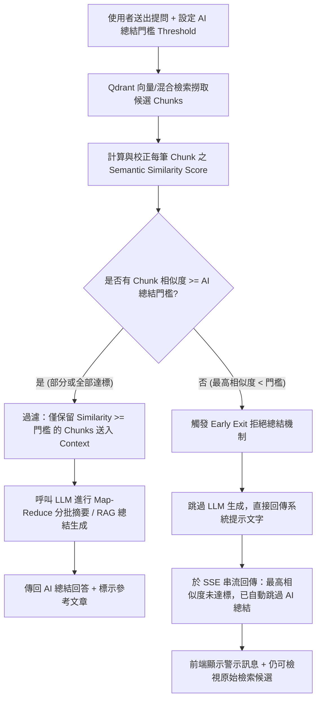

# AI 總結相似度門檻與拒絕生成機制 (AI Summarization Similarity Cutoff Threshold) 規劃文件

> 狀態：**已實作，但審查發現問題待修正**（2026-07-13 選定 A 方案實作；2026-07-14 審查發現前端未接住 Early Exit 警示訊息等問題，見第 8 節）  
> 功能類型：**檢索過濾與 AI 生成防護網 (Retrieval Guard & Generation Guard)**  
> 核心目標：提供前端使用者設定「AI 總結最低相似度門檻」，當檢索到的文件片段相似度低於此門檻時，自動排除該片段；若所有片段均低於門檻，則自動跳過 AI 總結生成，避免 LLM 產生幻覺（Hallucination）與浪費運算資源。  
> 相關計畫：[`NewFeaturesPlan_RRFScoreThresholdMismatchPlan.md`](NewFeaturesPlan_RRFScoreThresholdMismatchPlan.md)（相似度分數尺度校正）、[`NewFeaturesPlan_RetrievalStatsDashboardPlan.md`](NewFeaturesPlan_RetrievalStatsDashboardPlan.md)（檢索命中統計儀表板）。

---

## 1. 問題背景與需求分析

### 1.1 現行機制問題點診斷

在現行 AiRAG 系統中，檢索與生成流程運作如下：
1. **檢索階段 (Retrieval)**：系統透過 `vector`、`hybrid` 或 `semantic_hybrid*`（語義雙階段檢索）從 Qdrant 撈取最相關的 Top-K 筆 Chunk。即使在右側邊欄設定了 `SCORE THRESHOLD`（例如 0.70），在以下情況中仍會回傳低相似度的 Chunk：
   - 走雙階段擴展檢索 (`search_similar_two_step`) 時，鄰居片段採用較寬鬆的 `neighbor_score_threshold`（預設 0.1）。
   - 走 RRF 融合或多查詢擴充時，排名較後續的補充片段分數較低。
2. **脈絡組裝與生成階段 (Context Assembly & AI Generation)**：
   - 目前 `backend/routers/rag.py` 取得 `raw_results` 後，會將所有回傳的 `raw_results` 完整組裝成 `context_parts`。
   - **無論這些 Chunk 的真實 Similarity 分數多低（例如 0.36、0.25、0.14 甚至 0.04），都會一股腦全部塞進 Prompt 送給 LLM 做總結與回答！**
3. **產生的副作用**：
   - **LLM 嚴重幻覺與硬寫回答**：當知識庫中根本沒有與使用者提問相關的內容時，檢索強行回傳低相關片段（如 0.05），LLM 接收到這些無關脈絡後，容易「強行關聯」或「憑空總結」，產生高風險的虛假答案。
   - **無效消耗 GPU 算力與 Token 成本**：傳送大量無關片段給地端 AI (vLLM / Ollama)，造成推論延遲拉長，浪費 Context Token。
   - **缺乏前端控制權**：使用者無法彈性定義「低於多少相似度就不值得 AI 參考與總結」。

> **使用者實測案例（參考畫面）**：  
> 在檢索結果中，Top-1 相似度為 1.08，Top-2 為 0.71，但隨後包含 0.57、0.36、0.25、0.14、0.05、0.04 等多筆低分數 Chunk。若未設定 AI 總結門檻，這些 0.05、0.04 的噪音片段也會被放入 AI 總結的脈絡中。

---

## 2. 功能需求與核心設計

本功能旨在建立**雙層過濾與拒絕總結防護機制 (Dual-Layer Filtering & Guard)**：



### 2.1 雙層防護機制詳細定義

1. **第一層：片段級脈絡過濾 (Chunk-Level Context Filtering)**
   - 設定「AI 總結相似度門檻」（例如 `ai_summary_score_threshold = 0.60`）。
   - 當檢索回傳 13 筆片段，其中有 3 筆相似度 ≥ 0.60，10 筆 < 0.60 時：
     - **僅將達標的 3 筆片段塞入 `context_parts` 送給 LLM**。
     - 低於 0.60 的 10 筆片段自動被排除在 LLM 提示詞外，不干擾 AI 總結品質。

2. **第二層：全域無相關拒絕總結機制 (Hard Cutoff & Early Exit)**
   - 當所有檢索到的片段相似度都低於設定門檻（即 `max_similarity < ai_summary_score_threshold`，或者達標筆數為 0）：
     - **完全不呼叫 LLM 生成 API**！
     - 系統直接串流輸出友善警示訊息：「**檢索到的資料最高相似度（{max_score:.2f}）低於您設定的 AI 總結門檻（{threshold:.2f}），系統已自動跳過 AI 總結生成，避免產生不相關之幻覺回答。**」
     - 節省 100% 的 LLM 推論時間與 Token 算力。

3. **第三層：前端參考引用區視覺化標記 (Visual Indicator in Reference Chunks)**
   - 在前端「參考文章引用 (Chunks)」列表中，仍可展示檢索出的候選片段，但會清晰標記：
     - **[綠色/藍色徽章]** `Similarity: 0.75 | 已採納至 AI 總結`
     - **[灰色/黃色徽章]** `Similarity: 0.36 | 低於總結門檻 (未採納)`

---

## 3. 前後端架構與程式碼改動規劃

### 3.1 前端改動細節 (Frontend)

#### 1. 參數狀態管理 (`frontend/src/stores/paramsStore.js`)
新增 `aiSummaryScoreThreshold`（AI 總結相似度門檻）狀態：
```javascript
export const useParamsStore = defineStore('params', {
  state: () => ({
    // ...既有參數...
    scoreThreshold: 0.70, // 既有：Qdrant 初篩門檻
    aiSummaryScoreThreshold: 0.60, // 新增：AI 總結最低相似度過濾門檻 (預設 0.60)
    aiSummaryScoreThresholdEnabled: true, // 新增：是否啟用 AI 總結門檻過濾
  }),
  actions: {
    resetParams() {
      // 重置時歸位
      this.aiSummaryScoreThreshold = 0.60;
      this.aiSummaryScoreThresholdEnabled = true;
    }
  }
});
```

#### 2. 設定面板 UI (`frontend/src/components/params/RagParamsPanel.vue`)
在「檢索設定 (Retrieval)」區塊中，於 `SCORE THRESHOLD` 下方新增專屬控制元件：

```vue
<!-- AI 總結相似度門檻設定 -->
<div class="space-y-2 pt-2 border-t border-slate-700/50">
  <div class="flex items-center justify-between">
    <label class="text-xs font-medium text-slate-300 flex items-center gap-1.5">
      <span>AI 總結相似度門檻 (AI SUMMARY THRESHOLD)</span>
      <span class="text-xs text-slate-400 font-normal">(低於此值不給 AI 做總結)</span>
    </label>
    <div class="flex items-center gap-2">
      <input 
        type="checkbox" 
        v-model="paramsStore.aiSummaryScoreThresholdEnabled" 
        class="rounded bg-slate-800 border-slate-700 text-purple-600 focus:ring-purple-500 h-3.5 w-3.5"
      />
      <span class="text-xs font-bold text-[#a78bfa] font-display">
        {{ paramsStore.aiSummaryScoreThresholdEnabled ? paramsStore.aiSummaryScoreThreshold.toFixed(2) : '已關閉' }}
      </span>
    </div>
  </div>
  <input 
    type="range" 
    min="0.00" 
    max="1.00" 
    step="0.05"
    :disabled="!paramsStore.aiSummaryScoreThresholdEnabled"
    v-model.number="paramsStore.aiSummaryScoreThreshold"
    class="w-full h-1.5 bg-slate-700 rounded-lg appearance-none cursor-pointer accent-purple-500 disabled:opacity-40"
  />
  <p class="text-[11px] text-slate-400">
    當檢索到的內容相似度低於此數值時，將不會送入 AI 產生總結；若全部片段皆低於此門檻，系統將自動跳過 AI 總結。
  </p>
</div>
```

#### 3. 對話請求 Payload (`frontend/src/stores/chatStore.js`)
在 `sendMessage()` 呼叫後端 `/api/rag/chat` 時，將門檻參數放入 `params`：
```javascript
const payload = {
  question,
  knowledge_base_id: paramsStore.selectedKbId,
  chat_history: history,
  params: {
    // ...既有參數...
    score_threshold: paramsStore.scoreThreshold,
    ai_summary_score_threshold: paramsStore.aiSummaryScoreThresholdEnabled 
      ? paramsStore.aiSummaryScoreThreshold 
      : 0.0, // 若關閉則門檻設為 0.0 (全部允許)
  }
};
```

#### 4. 參考引用列表樣式微調 (`frontend/src/components/chat/ReferenceChunks.vue` 或 `ChatView.vue`)
依據後端回傳的 `sources` 筆數與 `included_in_ai_context` 狀態，為每筆 Chunk 標示視覺徽章：
- `Similarity >= ai_summary_score_threshold`: `bg-emerald-500/20 text-emerald-300`（標示：已參照）
- `Similarity < ai_summary_score_threshold`: `bg-slate-700/50 text-slate-400 line-through decoration-slate-500`（標示：未達標/已排除）

---

### 3.2 後端改動細節 (Backend)

#### 1. Request Schema 調整 (`backend/schemas/retrieval.py` 與 `backend/routers/rag.py`)
在 `ChatParams` Model 中新增欄位：
```python
class ChatParams(BaseModel):
    # ...既有欄位...
    score_threshold: Optional[float] = 0.65
    ai_summary_score_threshold: Optional[float] = Field(
        default=0.60, 
        description="AI 總結最低相似度門檻，低於此分數之片段不放入 AI Context；全數低於此門檻則拒絕生成總結"
    )
```

#### 2. RAG 主流程過濾與跳過邏輯 (`backend/routers/rag.py`)
修改 `rag_chat_stream()` 函式中組裝 `context_parts` 與呼叫 LLM 的區段：

```python
# Extract parameters
ai_summary_threshold = 0.60
if request.params and request.params.ai_summary_score_threshold is not None:
    ai_summary_threshold = request.params.ai_summary_score_threshold

# ...執行 Qdrant / Hybrid 檢索取得 raw_results...

context_parts = []
valid_context_sources = []
max_retrieved_score = 0.0

for idx, item in enumerate(raw_results):
    # 統一取得同尺度的 semantic_score（相容 RRF 與純向量）
    semantic_score = item.get("semantic_score", item.get("score", 0.0))
    max_retrieved_score = max(max_retrieved_score, semantic_score)
    
    # 判斷該片段是否符合 AI 總結門檻
    passed_ai_threshold = (semantic_score >= ai_summary_threshold)
    
    # 紀錄至 sources metadata 供前端渲染
    source_entry = {
        "chunk_id": item.get("chunk_id"),
        "content": item.get("content", ""),
        "metadata": {
            **item.get("metadata", {}),
            "included_in_ai_context": passed_ai_threshold,
            "semantic_score": round(semantic_score, 4)
        },
        "score": item.get("score", 0.0),
        "semantic_score": round(semantic_score, 4),
        "token_count": count_tokens(item.get("content", ""))
    }
    sources.append(source_entry)

    # 第一層過濾：只有達標的 Chunk 才塞進 context_parts 送給 LLM
    if passed_ai_threshold:
        valid_context_sources.append(source_entry)
        chunk_idx = item.get("metadata", {}).get("chunk_index")
        chunk_idx_str = f"#{chunk_idx}" if chunk_idx is not None else "?"
        context_parts.append(
            f"【來源文件：{item.get('metadata', {}).get('filename', '未知')} | 段落編號：{chunk_idx_str}】\n"
            f"內容：{item.get('content', '')}"
        )

# 發送 vector_search 階段事件與統計說明
if valid_context_sources:
    search_details = (
        f"檢索模式: {search_type}\n"
        f"成功召回 {len(raw_results)} 筆片段（最高相似度: {max_retrieved_score:.4f}）。\n"
        f"符合 AI 總結門檻（>= {ai_summary_threshold:.2f}）共 {len(valid_context_sources)} 筆，已納入 AI 總結脈絡。"
    )
    yield f"event: step\ndata: {json.dumps({'step': 'vector_search', 'status': 'success', 'content': search_details}, ensure_ascii=False)}\n\n"
else:
    # 第二層防護：全數未達標，觸發 Early Exit
    search_details = (
        f"檢索完成，共召回 {len(raw_results)} 筆片段。\n"
        f"【警示】所有片段最高相似度為 {max_retrieved_score:.4f}，均低於設定之 AI 總結門檻（{ai_summary_threshold:.2f}）。\n"
        f"系統將自動跳過 AI 總結生成。"
    )
    yield f"event: step\ndata: {json.dumps({'step': 'vector_search', 'status': 'warning', 'content': search_details}, ensure_ascii=False)}\n\n"

# ---------------------------------------------------------
# 判斷是否需要呼叫 LLM 進行總結生成
# ---------------------------------------------------------
if not context_parts:
    # 傳送直出文字訊息給前端，並結束串流（完全不花費 LLM token）
    skipped_msg = (
        f"⚠️ **未執行 AI 總結**\n\n"
        f"知識庫中檢索到的相關內容最高相似度為 `{max_retrieved_score:.2f}`，"
        f"低於您設定的 AI 總結最低門檻 (`{ai_summary_threshold:.2f}`)。\n\n"
        f"為了避免 AI 在缺乏高相關資料時產生幻覺，系統已自動暫停總結輸出。"
        f"您可以嘗試：\n"
        f"1. 在右側面板降低「AI 總結相似度門檻」。\n"
        f"2. 調整提問關鍵字或更換檢索模式。"
    )
    # 以 SSE 串流 delta 格式輸出
    yield f"event: message\ndata: {json.dumps({'delta': skipped_msg}, ensure_ascii=False)}\n\n"
    # 回送 sources 給前端展示原始參考 chunks（供使用者檢視）
    yield f"event: sources\ndata: {json.dumps({'sources': sources}, ensure_ascii=False)}\n\n"
    return

# 若有達標 Chunk，才接續執行 Map-Reduce 分批摘要與 LLM 送碼流程...
```

#### 3. 與檢索命中儀表板整合 (`backend/services/retrieval_stats_service.py`)
在紀錄 `RetrievalStats` 時，記錄是否觸發了跳過總結：
- `ai_summary_triggered: bool` (若 `valid_context_sources > 0` 為 True，否則為 False)。

---

## 4. API 合約變更 (API Contract Updates)

對應需同步更新 [`docs/03_API_CONTRACT.md`](../03_API_CONTRACT.md)：

1. **`POST /api/rag/chat` Request Body `params` 增加欄位**：
   - `ai_summary_score_threshold` (`float`, 可選，預設 `0.60`): 指定 AI 總結之最低相似度過濾門檻。
2. **`sources` 事件 Payload 新增欄位**：
   - 每筆 source 物件新增 `"semantic_score": float` 與 `"metadata.included_in_ai_context": bool`。

---

## 5. 決策紀錄與確認事項 (Decisions & Confirmed Trade-offs)

> 決策結果（2026-07-13）：使用者已全數確認採用 **選項 A 方案** 進行開發。

| 討論項目 | 決策結果 (選項 A) | 評估與執行說明 |
|---|---|---|
| **1. 雙門檻獨立性** | **採用 A：獨立兩個 Slider**<br>- `SCORE THRESHOLD` (Qdrant 檢索初篩)<br>- `AI SUMMARY THRESHOLD` (AI 總結過濾) | 給予使用者最高彈性，允許寬鬆檢索 Top-K 候選，但僅送出最相關的片段進行 AI 總結。 |
| **2. 未達標 Chunks 顯示** | **採用 A：前端繼續展示，並加上「未採納」灰階/刪除線標籤** | 維持最高透明度，讓使用者能觀察被檢索出但因分數偏低被擋在 AI 總結外之片段。 |
| **3. 拒絕總結時的回應方式** | **採用 A：SSE 直出提示文字 + 回傳 Sources，零 LLM 算力消耗** | 實作硬防護 (Hard Guard)，全數未達標時 100% 杜絕 LLM 幻覺並節省 GPU 推論算力。 |


---

## 6. 分階段實作與驗證計畫 (Implementation Roadmap)

### Phase 1: 後端核心邏輯與 Schema 實作 (Backend Phase)
- [x] 修改 `backend/schemas/retrieval.py`，新增 `ai_summary_score_threshold` 欄位。
- [x] 修改 `backend/routers/rag.py`：
  - [x] 實作片段級過濾：僅保留 `semantic_score >= ai_summary_score_threshold` 之 Chunk 放入 `context_parts`。
  - [x] 實作全域 Early Exit：當無達標片段時，跳過 LLM 呼叫，直接串流警示訊息與 `sources`。
  - [x] 在 `sources` 中回傳 `included_in_ai_context` 與 `semantic_score`。
- [x] 執行 Python 語法與編譯測試驗證。

### Phase 2: 前端 UI 與 Store 整合 (Frontend Phase)
- [x] 修改 `frontend/src/stores/paramsStore.js`：新增 `aiSummaryScoreThreshold` 狀態與預設值。
- [x] 修改 `frontend/src/components/params/RagParamsPanel.vue`：新增 AI 總結門檻 Slider 控制項與說明提示。
- [x] 修改 `frontend/src/stores/chatStore.js`：於 API payload 帶入 `ai_summary_score_threshold`。
- [x] 修改 `frontend/src/components/chat/SourceChunks.vue` 參考文章引用區塊：對達標標示「已採納」，未達標標示「未採納」紅/灰階標籤。

### Phase 3: 文件與合約更新 (Documentation)
- [x] 更新 `docs/03_API_CONTRACT.md`（ChatParams 與 sources payload）。
- [x] 更新 `docs/DevelopmentProcess/NewFeatures.md` 紀錄此優化。
- [x] 更新 `docs/DevelopmentProcess/FrontendCorrection.md` 與 `BackendCorrection.md`。

---

## 7. 驗證情境清單 (Verification Test Cases)

1. **情境 A：正常檢索 (部分片段達標)**
   - 設定 AI 總結門檻 `0.60`。
   - 檢索回傳 Similarity 為 `[0.85, 0.72, 0.45, 0.30]`。
   - **預期結果**：僅 0.85 與 0.72 被納入 AI 總結脈絡，AI 正常生成回答；前端參考文章中 0.45 與 0.30 標示為「未採納」。
2. **情境 B：全數未達標 (觸發拒絕總結)**
   - 設定 AI 總結門檻 `0.80`。
   - 檢索回傳 Similarity 為 `[0.55, 0.40, 0.25]`。
   - **預期結果**：系統不呼叫 LLM，直接輸出「最高相似度 0.55 低於總結門檻 0.80，系統已自動跳過 AI 總結」警示訊息；`vector_search` 步驟標示 warning。
3. **情境 C：關聯附件查詢法 (`semantic_hybrid_attachment`) 相容性**
   - 驗證附件內容之 Token 與相似度過濾邏輯運作正常。

---

## 8. 程式碼審查發現之問題與修正建議 (Code Review Findings)

> 審查日期：2026-07-14。狀態：**已全數完成修正**（2026-07-14 修復完成）。

### 8.1 🔴 嚴重：Early Exit 警示訊息前端未渲染，使用者看不到

**問題描述**：
- 後端 `backend/routers/rag.py` 全域拒絕總結時（Hard Cutoff），是用新事件 `event: message`、`data: {"delta": skipped_msg}` 送出警示文字（見 `rag.py` 第 641 行左右）。
- 前端 `frontend/src/stores/chatStore.js` 的 SSE 事件分派邏輯（`_streamChat()` 內約第 172-283 行）只處理了 `currentEvent === 'chunk' / 'step' / 'sources'` 三種事件，**沒有處理 `event: message`**，也沒有任何地方讀取 `data.delta`。
- `frontend/src/components/chat/MessageBubble.vue` 第 181-182 行是直接綁定 `message.content` 顯示，沒有 fallback。
- **實際後果**：觸發「全數片段未達 AI 總結門檻」的 Hard Cutoff 時，`msg.content` 永遠是空字串，使用者只會看到一個空白的助理訊息泡泡，完全看不到「⚠️ 未執行 AI 總結…」的說明文字。唯一能看到警示的地方是使用者手動展開「向量資料查詢」步驟面板（因為該 `step` 事件的 `status: 'warning'` 有被正常處理），但一般使用者不會特別去展開技術細節區塊。
- 這直接違背本規劃文件 2.1 節第 2 點「系統直接串流輸出友善警示訊息」的設計目標，以及第 7 節驗證情境 B 的預期行為。

**修正方法**：
- 在 `frontend/src/stores/chatStore.js` 的事件分派 `if/else if` 鏈中新增一個分支：
  ```javascript
  } else if (currentEvent === 'message') {
    const msg = this.messages.find(m => m.id === assistantMessageId)
    if (msg && typeof data.delta === 'string') {
      msg.content = data.delta
      // 同步結案步驟內容，讓「結論」步驟面板也能看到同一段文字
      const conclStep = msg.steps?.find(s => s.key === 'conclusion')
      if (conclStep) {
        conclStep.status = 'success'
        conclStep.content = data.delta
      }
    }
  }
  ```
- 放置順序建議放在既有 `else if (currentEvent === 'sources')` 之後（或之前皆可，彼此不衝突）。
- 修正後應重新走一次驗證情境 B，確認助理訊息泡泡確實顯示警示文字，而不必展開步驟面板才看得到。

### 8.2 🟡 中等：附件查詢法 (`semantic_hybrid_attachment`) 可能被 Early Exit 誤殺

**問題描述**：
- 附件 ID 收集邏輯（`rag.py` 內 `attachment_ids` 收集迴圈）不檢查 `ai_summary_score_threshold`，只要 `raw_results` 中有 `linked_attachments` 就會抓取附件內容。
- 但 Hard Cutoff 的 Early Exit 判斷式（`if not context_str and search_type != "semantic_db_query" and request.knowledge_base_id:`）發生在「把附件內容併入 Map-Reduce blocks」的區塊**之前**就會 `return`。
- **實際後果**：若核心命中片段全部低於 `ai_summary_score_threshold`（但其關聯附件其實含有與問題相關的內容），系統會直接判定「全數未達標」並中止，附件內容從未真正送進 LLM——即便使用者已勾選「AI 讀取附件內容」。這與第 7 節驗證情境 C 的意圖（附件查詢法相容性）互相矛盾。

**修正方法（擇一，建議 A）**：
- **方案 A（建議）**：讓附件內容也納入「是否達標」的判斷。當 `context_parts` 為空、但 `search_type == "semantic_hybrid_attachment"` 且 `read_attachment_content` 為真且確實有 `attachments_data` 時，不觸發 Early Exit，改為僅用附件內容組裝 `context_str`（略過一般 Chunk），讓 Map-Reduce 區塊仍有機會把附件文字送進 LLM。
- **方案 B（較簡單但較保守）**：維持現有 Early Exit 邏輯不變，但在跳過總結的警示文字中，明確告知使用者「檢索到的關聯附件因未一併納入相似度判斷，本次未被送入總結」，避免使用者誤以為系統有讀取附件卻答不出來；同時建議在 UI 提示使用者可切換至不會被此門檻擋下的检索模式。
- 不論採哪個方案，都應該依驗證情境 C 實測一次「核心片段全未達標、但確實有相關附件」的情境，確認行為符合預期。

### 8.3 🟢 次要：`backend/schemas/retrieval.py` 新增欄位為死碼

**問題描述**：
- `backend/schemas/retrieval.py` 的 `SearchParams.ai_summary_score_threshold` 欄位已宣告，但 `backend/routers/retrieval.py`（`/api/retrieval/search` 端點）完全沒有讀取這個欄位，對檢索測試頁沒有任何實際效果。
- 目前真正生效的只有 `backend/routers/rag.py` 內另外獨立定義的 `ChatParams.ai_summary_score_threshold`（僅作用於 `/api/rag/chat`）。

**修正方法**：
- 若這個欄位未來也打算套用到 `/api/retrieval/search`（檢索測試頁），需要在 `backend/routers/retrieval.py` 對應的搜尋邏輯中實際讀取 `request.params.ai_summary_score_threshold` 並套用篩選，同時更新 `docs/03_API_CONTRACT.md` 說明其在該端點的行為。
- 若沒有規劃要套用到該端點，建議直接從 `SearchParams` 移除此欄位，避免死碼誤導後續開發者以為 `/api/retrieval/search` 也有做這層過濾（依 `AGENT.md`「不新增非必要程式碼」原則）。

### 8.4 🟢 次要：Refactor 過程中意外刪除「未選知識庫」的提示分支

**問題描述**：
- 比對 `git diff` 可發現，原本 `rag_chat_stream()` 中 `if request.knowledge_base_id: ... else: yield '無目標知識庫，略過語義分析/向量查詢'` 的 `else` 分支，在本次改動中被整個移除，且沒有等效替代（目前結構變成 `if search_type == "semantic_db_query": ... elif request.knowledge_base_id: ...`，沒有對應的 `else`）。
- **影響評估**：目前前端 `paramsStore.knowledgeBaseId` 預設一定是非空字串，唯一會送出 `knowledge_base_id: null` 的情境（「不限定知識庫」checkbox）又會強制 `search_type` 為 `semantic_db_query`，因此這條路徑在目前 UI 下應該打不到，風險偏低，但屬於超出本次功能範圍的行為變更（不是本功能需要的修改）。

**修正方法**：
- 若確認「完全不選知識庫、且非語義資料庫查詢法」在產品上仍是合法情境（例如未來要支援純 LLM 聊天模式），應補回等效的 `else` 分支：
  ```python
  elif search_type != "semantic_db_query":
      yield f"event: step\ndata: {json.dumps({'step': 'semantic_analysis', 'status': 'success', 'content': '無目標知識庫，略過語義分析。'}, ensure_ascii=False)}\n\n"
      yield f"event: step\ndata: {json.dumps({'step': 'vector_search', 'status': 'success', 'content': '無目標知識庫，略過向量資料查詢。'}, ensure_ascii=False)}\n\n"
  ```
- 若確認此情境在目前產品設計下不會發生，則此項可標記為「不需修正」，但建議在程式碼中加註說明原因，避免日後誤判為遺漏。

### 8.5 待辦追蹤

- [x] 修正 8.1（`chatStore.js` 補上 `event: message` 處理）— 已修復。
- [x] 確認並修正 8.2（附件查詢法與 Early Exit 的互動）— 採方案 A，計算 `has_attachments` 避開誤殺並進入 Map-Reduce。
- [x] 決定 8.3 去留（補齊 `/api/retrieval/search` 的過濾邏輯，或移除死碼欄位）— 已依 `AGENT.md` 原則移除死碼。
- [x] 決定 8.4 是否需要補回「未選知識庫」提示分支 — 已補回等效 `else` 分支發送 `step` 提示。
- [ ] 修正後依第 7 節驗證情境 A/B/C 全部重新手動測試一次（由使用者測試）。

### 8.6 複查結果（2026-07-14）

複查 8.1～8.4 的實際程式碼變更（`git diff` 逐行比對 + `python -m py_compile` / `node --check` 語法驗證），確認四項修正皆正確：
- 8.1：`frontend/src/stores/chatStore.js` 已新增 `event: message` 分支，`msg.content` 與 `conclusion` 步驟會被正確賦值。
- 8.2：新增 `has_attachments` 判斷並同步更新 Early Exit 條件與 Map-Reduce 觸發條件，追蹤 `ContextSummarizerService.maybe_summarize` 確認在核心片段全未達標但有附件時，`context_str` 仍會由附件內容組成並送進 LLM。
- 8.3：`backend/schemas/retrieval.py` 死碼欄位已移除。
- 8.4：`if / elif / else` 完整鏈結構已恢復，「無目標知識庫」情境會正確送出提示 `step` 事件。

**新發現的小瑕疵（尚未修正，非本次回報的 4 項之一）**：
- `backend/routers/rag.py` 第 572-578 行左右，當 `search_type == "semantic_hybrid_attachment"` 且 `read_attachment_content` 為真、附件存在，但核心片段全數未達 AI 總結門檻時，`vector_search` 步驟仍會顯示「系統已自動跳過 AI 總結生成」（`status: warning`）。但因 8.2 的修正，系統實際上**不會**跳過（會改用附件內容繼續總結）。
- 這只是步驟面板文字判斷未一併考慮 `has_attachments`，不影響實際生成流程，屬純文字誤導，不算功能性 bug。
- **修正建議**：將該分支的判斷式，比照 Early Exit 一併加上 `and not has_attachments`，未達標但有附件時改顯示「僅附件內容將納入總結」之類的訊息。
